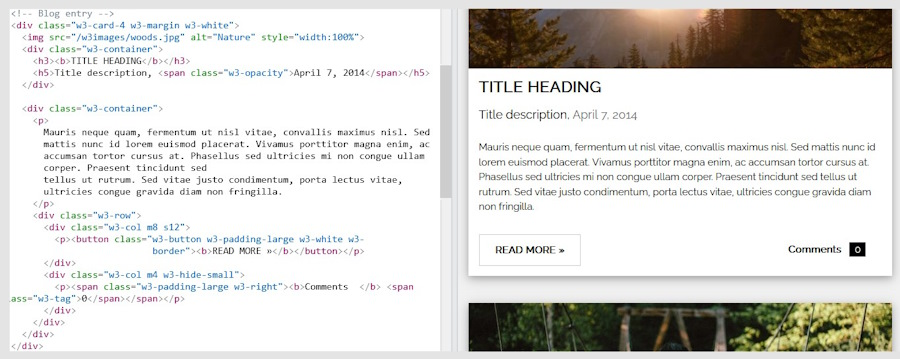

# Introduction

Welcome to the Easy HTML Template Creator!

Quickly copy and paste your favorite sections to create a beautiful and responsive HTML template.

---

## Why This Tool?

Have you seen a template creator that includes all of these items?&nbsp;🏆

<ul>
<li style="text-align: left;">Free</li>
<li style="text-align: left;">No registrations, logins, or software to download.</li>
<li style="text-align: left;">No embarrassing copyright footers or linkbacks. (see How To Show Appreciation &amp; Terms of Use)</li>
<li style="text-align: left;">No long and confusing css files to dig through.</li>
<li style="text-align: left;">Easy to read code with comments, colors, and images ready to replace with your own.</li>
<li style="text-align: left;">No bloated folders, javascript libraries, and other items. Only one file and one folder.</li>
<li style="text-align: left;">Uses the w3.css framework which is only about 23kb and is *very* easy to read!</li>
</ul>

!!!! 🙂 We are just getting started. Much more coming very soon!
