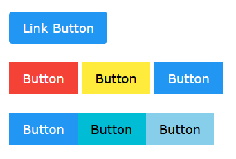

## Single Buttons
These can be put anywhere on your page.

```html
<a href="#" class="w3-orange w3-button w3-round">Link Button</a>
```

## Button Groups
You can group buttons together so they stay next to each other.

```html
<div class="w3-bar">
     <a href="#" class="w3-red w3-button">Button</a>
     <a href="#" class="w3-yellow w3-button">Button</a>
     <a href="#" class="w3-blue w3-button">Button</a>	
</div>
```

## Button Bars
This puts the buttons together to form a small mini menu bar that you can put anywhere on your page.

```html
<div class="w3-center">
     <div class="w3-bar">
          <a href="#" class="w3-blue w3-bar-item w3-button">Button</a>
          <a href="#" class="w3-cyan w3-bar-item w3-button">Button</a>
          <a href="#" class="w3-light-blue w3-bar-item w3-button">Button</a>	
     </div>
</div>	
```
