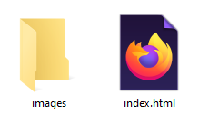

## File Setup
All you need is a blank *index.html* file and an *images* folder to put your pictures in. That's it!



## Code Previewer
This is optional, but I created a simple code previewer that automatically has the starter code added and shows you an automatic preview.
<p><a href="https://gracefulform.github.io/quick-html-template-creator/editor.html" class="button external-link no-image" style="background-color: #FA5F55; color: #ffffff; border: none; padding: 10px 20px; display: inline-block; text-decoration: none;" target="_blank" rel="noopener noreferrer nofollow">🖥️ Live Preview</a></p>


## Starting Code
Paste the following HTML code into your *index.html* file.

```html
<!--
To Do:
[] Change the title.
[] Change the meta description.
-->
<!DOCTYPE html>
<html>
<head>
<title>BUSINESS NAME HERE</title> 
<meta name="description" content="WRITE A DESCRIPTION OF YOUR PAGE">
<meta name="robots" content="index,follow">
<meta charset="utf-8">
<meta name="viewport" content="width=device-width, initial-scale=1">
<link rel="stylesheet" href="https://www.w3schools.com/w3css/5/w3.css">
</head>
<body>
<!-- Paste all sections BELOW this line -->


<!-- Paste all sections ABOVE this line -->
<script>
     // This plain javascript code will make your menu responsive to all screen sizes.
     function responsiveNav(){var s=document.getElementById("miniNav");-1==s.className.indexOf("w3-show")?s.className+=" w3-show":s.className=s.className.replace(" w3-show","")}
</script>
</body>
</html>
```
