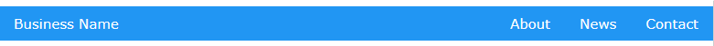
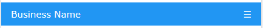
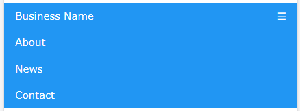
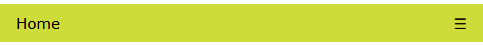
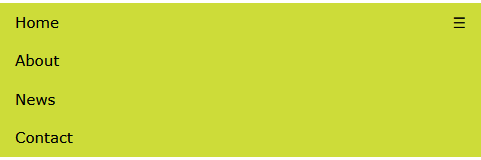

## Traditional Business Menu
	
This menu keeps your business name on the left and your other links to the right.







<a href="https://gracefulform.github.io/quick-html-template-creator/demo1.html" class="button" target="_blank" rel="noopener noreferrer">Live Preview</a>

```html
<nav class="w3-blue w3-bar">
	<a href="#" class="w3-bar-item w3-button">Business Name</a>
	<div class="w3-right">
		<a href="#" class="w3-bar-item w3-button w3-hide-small">About</a>
		<a href="#" class="w3-bar-item w3-button w3-hide-small">News</a>
		<a href="#" class="w3-bar-item w3-button w3-hide-small">Contact</a>
	</div>
	<a href="javascript:void(0)" class="w3-bar-item w3-button w3-right w3-hide-large w3-hide-medium" onclick="responsiveNav()">☰</a>
</nav>
<nav id="miniNav" class="w3-blue w3-bar-block w3-hide w3-hide-large w3-hide-medium">
	<a href="#" class="w3-bar-item w3-button">About</a>
	<a href="#" class="w3-bar-item w3-button">News</a>
	<a href="#" class="w3-bar-item w3-button">Contact</a>
</nav>
```

-----

## Centered Menu
	
This menu looks good if you already have your business name or logo at the top of your site.






```html
<nav class="w3-lime w3-bar">
	<div class="w3-center">
		<a href="#" class="w3-button w3-hide-small">About</a>
		<a href="#" class="w3-button w3-hide-small">News</a>
		<a href="#" class="w3-button w3-hide-small">Contact</a>
	</div>
    <a href="javascript:void(0)" class="w3-border-white w3-border-left w3-bar-item w3-button w3-right w3-hide-large w3-hide-medium" onclick="responsiveNav()">Menu</a>
</nav>
<nav id="miniNav" class="w3-lime w3-bar-block w3-hide w3-hide-large w3-hide-medium">
	<a href="#" class="w3-bar-item w3-button">About</a>
	<a href="#" class="w3-bar-item w3-button">News</a>
	<a href="#" class="w3-bar-item w3-button">Contact</a>
</nav>
```
