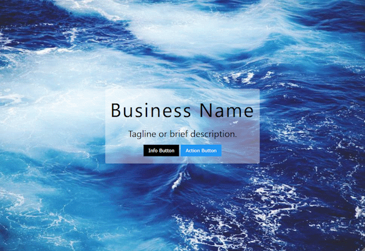

Headers are the first information that your visitor will see. This is where you introduce yourself, your site, or put something unforgettable so they will stay on your page.


## Light Hero Image
A hero image is an image that fills the visitor's screen. If your image has lighter colors, then the darker background will make your center text stand out.


```html
<!-- Header with Image -->
<header class="w3-display-container" style="height: 100vh; width: 100%; background-image: url('https://picsum.photos/1000/667.jpg'); background-size: cover; background-position: center; background-repeat: no-repeat; display: flex; align-items: center; justify-content: center;">
    <div class="w3-text-white w3-display-middle w3-center w3-padding w3-round" style="background-color: rgba(0, 0, 0, 0.4);">
        <h1 class="w3-wide" style="font-size:5vw;">Business Name</h1>
        <h2 class="w3-hide-medium w3-hide-small">Tagline or brief description.</h2>
        <p><a href="#" class="w3-black w3-button w3-margin-top">Info Button</a> <a href="#" class="w3-blue w3-button w3-margin-top">Action Button</a></p>
    </div>
</header>
<!-- End Header with Image -->
```

-----

## Dark Hero Image
If your image has darker colors, then the lighter background will make your center text stand out.



```html
<!-- Header with Image -->
<header class="w3-display-container" style="height: 100vh; width: 100%; background-image: url('https://picsum.photos/1000/667.jpg'); background-size: cover; background-position: center; background-repeat: no-repeat; display: flex; align-items: center; justify-content: center;">
    <div class="w3-display-middle w3-center w3-padding w3-round" style="background-color: rgba(255, 255, 255, 0.4);">
        <h1 class="w3-wide" style="font-size:5vw;">Business Name</h1>
        <h2 class="w3-hide-medium w3-hide-small">Tagline or brief description.</h2>
        <p><a href="#" class="w3-black w3-button w3-margin-top">Info Button</a> <a href="#" class="w3-blue w3-button w3-margin-top">Action Button</a></p>
    </div>
</header>
<!-- End Header with Image -->
```

---

## Standard Header Image
This header image is not too big and not too small. Pick from some light or dark choices below:

[ui-accordion independent=false open=none]
[ui-accordion-item title="Lighten Image with Black Text"]

```html
<header class="w3-display-container w3-wide">
	
	<div class="w3-white w3-display-topleft w3-opacity-max" style="width:100%; height:100%; position:absolute;"></div>
	<div class="w3-display-middle w3-margin-top w3-center" style="z-index:1;">
		<h1 class="w3-text-black" style="font-size: 5vw;">Business Name</h1>
	</div>
</header>
```

[/ui-accordion-item]
[ui-accordion-item title="Darken Image with White Text"]

```html
<header class="w3-display-container w3-wide">
	
	<div class="w3-black w3-display-topleft w3-opacity-max" style="width:100%; height:100%; position:absolute;"></div>
	<div class="w3-display-middle w3-margin-top w3-center" style="z-index:1;">
		<h1 class="w3-text-white" style="font-size: 5vw;">Business Name</h1>
	</div>
</header>
```

[/ui-accordion-item]
[/ui-accordion]