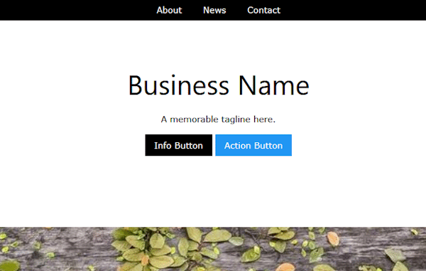
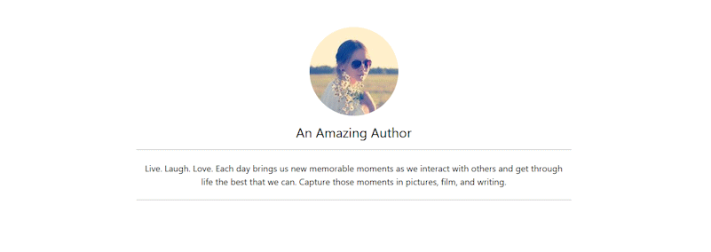

These headers focus on text and information rather than a large image.

## Professional Top Name
This is used on clean and minimal sites and blogs to show your business or author name.



```html
<header class="w3-center w3-padding-64">
	<h1 class="w3-xxxlarge">Business Name</h1>
	<p>A memorable tagline here.</p>
	<p><a href="#" class="w3-black w3-button">Info Button</a> <a href="#" class="w3-blue w3-button">Action Button</a></p>
</header>
```

-----

## Avatar
This simple author / blog style is credited to a well known blogging theme called Vapor. 



```html
<header class="w3-container w3-center w3-padding-64">
	<p></p>
	<h2>An Amazing Author</h2>
	<div class="w3-border-grey w3-panel w3-content w3-border-bottom w3-border-top w3-padding-16">
		<h4>Live. Laugh. Love. Each day brings us new memorable moments as we interact with others and get through life the best that we can. Capture those moments in pictures, film, and writing.</h4>	
	</div>
</header>
```