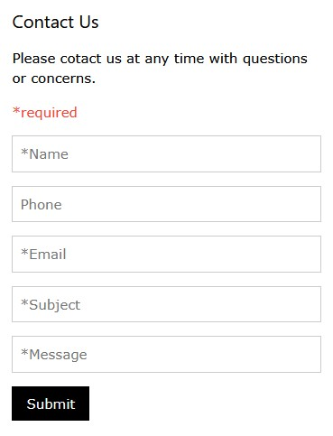

## Contact Form
This form is responsive to all screen sizes. You can use it in a column to keep it from taking up the width of the screen, and put your business contact information in the other column.



```html
<div class="w3-container">
	<h4>Contact Us</h4>
	<p>Please contact us at any time with questions or concerns.</p>
	<p class="w3-text-red">*required</p>
	<form action="/link-to-action-script">
		<p><input class="w3-input w3-border" type="text" placeholder="*Name" name="name" required></p>
		<p><input class="w3-input w3-border" type="tel" placeholder="Phone" name="phone"></p>		
		<p><input class="w3-input w3-border" type="email" placeholder="*Email" name="email" required></p>
		<p><input class="w3-input w3-border" type="text" placeholder="*Subject" name="subject" required></p>
		<p><input class="w3-input w3-border" type="text" placeholder="*Message" name="message" required></p>
		<button class="w3-black w3-button" type="submit">Submit</button>
	</form>
</div>
```

## Search Bar
You can edit the size of the text box by changing the width to px or %.

```html
<form class="w3-panel">
	<input class="w3-input w3-border" placeholder="Search" type="text" style="width:300px">
</form>
```