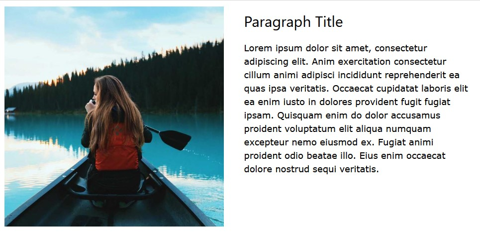

Text and images can go side by side.

## Left Image with Right Text
On small screens, the left column will appear first and the right column below it.



```html
<div class="w3-row w3-content">
	<div class="w3-col m6 w3-padding-large">
		
	</div>
	<div class="w3-col m6 w3-padding">
		<h2>Paragraph Title</h2>
		<p class="w3-large">
			Lorem ipsum dolor sit amet, consectetur adipiscing elit. Anim exercitation consectetur cillum animi adipisci incididunt reprehenderit ea quas ipsa veritatis. Occaecat cupidatat laboris elit ea enim iusto in dolores provident fugit fugiat ipsam. Quisquam enim do dolor accusamus proident voluptatum elit aliqua numquam excepteur nemo eiusmod ex. Fugiat animi proident odio beatae illo. Eius enim occaecat dolore nostrud sequi veritatis.
		</p>
	</div>
</div>
```

---

## Left Text with Right Image
```html
<div class="w3-row w3-content">
	<div class="w3-col m6 w3-padding">
		<h2>Paragraph Title</h2>
		<p class="w3-large">
			Lorem ipsum dolor sit amet, consectetur adipiscing elit. Anim exercitation consectetur cillum animi adipisci incididunt reprehenderit ea quas ipsa veritatis. Occaecat cupidatat laboris elit ea enim iusto in dolores provident fugit fugiat ipsam. Quisquam enim do dolor accusamus proident voluptatum elit aliqua numquam excepteur nemo eiusmod ex. Fugiat animi proident odio beatae illo. Eius enim occaecat dolore nostrud sequi veritatis.
		</p>
	</div>
	<div class="w3-col m6 w3-padding-large">
		
	</div>
</div>
```

## Listings
These are great for blog home pages, portfolios, news listings, and store products.


```html
<div class="w3-content">
	<!-- This section can repeat as many times as you wish. -->
	<div class="w3-row w3-margin">
		<div class="w3-third">
			
		</div>
		<div class="w3-twothird w3-container">
			<h2>Article One</h2>
			<p>
				Lorem ipsum dolor sit amet, consectetur adipiscing elit, sed do eiusmod tempor incididunt ut labore et dolore magna aliqua. Ut enim ad minim veniam, quis nostrud exercitation ullamco laboris nisi ut aliquip ex ea commodo consequat...
			</p>
			<a href="#" class="w3-black w3-button w3-small w3-round w3-right">Read More</a>
		</div>
	</div>
	<hr>
	<!-- End of repeatable secton. -->
	<div class="w3-row w3-margin">
		<div class="w3-third">
			
		</div>
		<div class="w3-twothird w3-container">
			<h2>Article Two</h2>
			<p>
				Lorem ipsum dolor sit amet, consectetur adipiscing elit, sed do eiusmod tempor incididunt ut labore et dolore magna aliqua. Ut enim ad minim veniam, quis nostrud exercitation ullamco laboris nisi ut aliquip ex ea commodo consequat...
			</p>
			<a href="#" class="w3-black w3-button w3-small w3-round w3-right">Read More</a>
		</div>
	</div>
	<hr>
	<div class="w3-row w3-margin">
		<div class="w3-third">
			
		</div>
		<div class="w3-twothird w3-container">
			<h2>Article Three</h2>
			<p>
				Lorem ipsum dolor sit amet, consectetur adipiscing elit, sed do eiusmod tempor incididunt ut labore et dolore magna aliqua. Ut enim ad minim veniam, quis nostrud exercitation ullamco laboris nisi ut aliquip ex ea commodo consequat...
			</p>
			<a href="#" class="w3-black w3-button w3-small w3-round w3-right">Read More</a>
		</div>
	</div>
	<hr>	
</div>
```